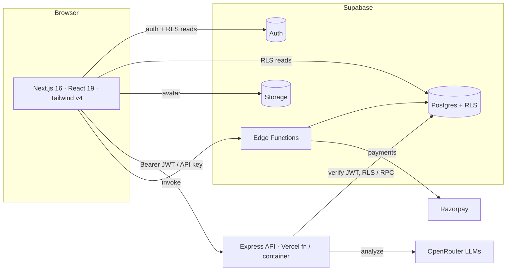

# 🛡️ Neural Shield AI

**AI-powered scam & fraud detection, built for India.** Paste a message, URL, email, phone
number, UPI ID, screenshot, or QR code and Neural Shield analyzes it the way a fraud
investigator would — returning a scam probability, trust score, risk level, the exact red
flags it found, and a clear recommendation, in seconds.

<!-- SCREENSHOT: hero / landing page (frontend/src/app/page.tsx) -->
<!-- SCREENSHOT: analyzer result panel showing a critical-risk SBI KYC scam -->

---

## Table of contents

- [Project overview](#project-overview)
- [Features](#features)
- [Architecture](#architecture)
- [Tech stack](#tech-stack)
- [Project structure](#project-structure)
- [Setup guide](#setup-guide)
- [Environment variables](#environment-variables)
- [Scripts](#scripts)
- [Deployment](#deployment)
- [Security](#security)
- [Documentation](#documentation)
- [Troubleshooting](#troubleshooting)
- [Status](#status)

## Project overview

Neural Shield AI is a full-stack web app. A Next.js frontend handles auth, the dashboard, and
the 7 scanners; a TypeScript Express API runs the LLM analysis (OpenRouter, multi-model
fallback) and persists results; Supabase provides Postgres (with Row-Level Security), auth,
storage, and edge functions (account deletion, Razorpay billing). Every data access is
enforced by RLS at the database, and the backend operates **under each user's JWT — it holds
no service-role key.**

## Features

- **7 scanners** — Message, URL, Email, Phone, UPI, plus Screenshot (OCR) & QR-code decode
- **LLM analysis** via OpenRouter with multi-model fallback (Claude → GPT-4o → GPT-4o-mini)
  and a per-call timeout + failover
- **India-tuned** detection: KYC, UPI/OTP, lottery (KBC), job & loan fraud, delivery scams
- **Auth & accounts** — Supabase Auth (email + Google/GitHub OAuth), RLS-secured per user
- **Business API** — generate keys and scan programmatically (`X-API-Key: nsk_...`)
- **Billing** — Razorpay checkout for Pro/Business upgrades (via a Supabase edge function)
- **Dashboard** — stats, risk distribution & scan-type charts, recent activity
- **History** — searchable, filterable, paginated, CSV export, bulk delete
- **Profile & settings** — avatar upload, notification prefs, API keys, password, sign-out
  everywhere, and real account deletion
- **Production hardening** — Helmet CSP, rate limiting, Zod validation, Winston logging, audit
  logs, automated tests, CI

## Architecture



Full architecture and data-flow diagrams: [`docs/PROJECT_BLUEPRINT.md`](docs/PROJECT_BLUEPRINT.md).

## Tech stack

| Layer | Stack |
|---|---|
| Frontend | Next.js 16 (App Router, React Compiler) · React 19 · TypeScript · Tailwind v4 · Framer Motion · Zustand · React Query · Recharts |
| Backend | Node 20 · Express 4 · TypeScript · Helmet · express-rate-limit · Zod · Winston · multer · Tesseract.js · jsQR |
| Data/Auth | Supabase (Postgres + Auth + Storage + Edge Functions), Row-Level Security |
| AI | OpenRouter (multi-model fallback) |

> Design tokens live in `frontend/src/app/globals.css` via Tailwind v4 `@theme` (OKLCH). See
> [`DECISIONS.md`](DECISIONS.md) for the architecture decisions behind this build.

## Project structure

```
/
├── frontend/            # Next.js app (landing, auth, dashboard, scanners, profile)
├── backend/             # Express + TypeScript scan API (+ tests/)
├── supabase/            # SQL migrations (0001..0007) + edge functions + setup guide
├── docs/                # full audit + architecture documentation
├── .github/workflows/   # CI (type-check, lint, test, build)
├── docker-compose.dev.yml
├── DECISIONS.md         # architecture decision log
└── README.md
```

## Setup guide

### 1. Database (Supabase)
Create a project, then apply the schema and configure auth — full steps in
[`supabase/README.md`](supabase/README.md):

```bash
supabase link --project-ref <ref>
supabase db push                                  # applies supabase/migrations/*
supabase functions deploy delete-account
supabase functions deploy razorpay-checkout
```

Copy your **Project URL** and **anon key**.

### 2. Backend
```bash
cd backend
cp .env.example .env        # add OPENROUTER_API_KEY + SUPABASE_URL + SUPABASE_ANON_KEY
npm install
npm run dev                 # http://localhost:5000  (health: /api/health)
```

### 3. Frontend
```bash
cd frontend
cp .env.example .env.local  # add NEXT_PUBLIC_SUPABASE_URL + NEXT_PUBLIC_SUPABASE_ANON_KEY
npm install
npm run dev                 # http://localhost:3000
```

> Without Supabase env configured, the app still runs locally: auth pages show a friendly
> "not configured" message and the backend uses a **dev auth bypass** (non-production only).

## Environment variables

**Backend** (`backend/.env`): `OPENROUTER_API_KEY`, `SUPABASE_URL`, `SUPABASE_ANON_KEY`,
`PORT`, `APP_URL`, `FRONTEND_URL`, `LOG_LEVEL`, `NODE_ENV` (optional: `OPENROUTER_MODELS`,
`OPENROUTER_TIMEOUT_MS`). The backend does **not** use a service-role key.

**Frontend** (`frontend/.env.local`): `NEXT_PUBLIC_SUPABASE_URL`,
`NEXT_PUBLIC_SUPABASE_ANON_KEY`, `NEXT_PUBLIC_API_URL`, `NEXT_PUBLIC_APP_URL`.

**Edge function secrets** (Supabase): `RAZORPAY_KEY_ID`, `RAZORPAY_KEY_SECRET` (for billing).

Full table: [`docs/deployment.md`](docs/deployment.md).

## Scripts

| | Frontend | Backend |
|---|---|---|
| Dev | `npm run dev` | `npm run dev` |
| Type-check | `npm run type-check` | `npm run type-check` |
| Lint | `npm run lint` | `npm run lint` |
| Test | — (E2E planned) | `npm test` (node:test, 25 tests) |
| Build | `npm run build` | `npm run build` |

> **Windows note:** run the Node toolchain from **PowerShell** (Git Bash on this machine
> can't resolve `node`).

## Deployment

- **Frontend → Vercel**: root directory `frontend/`, add the `NEXT_PUBLIC_*` env vars.
  Security headers are in `next.config.ts` + `vercel.json`.
- **Backend → Vercel** (serverless `api/index.ts`) **or a container host** (Railway/Render/Fly
  — recommended for reliable OCR): `docker build -t neural-shield-backend ./backend`.
- **Database → Supabase**: `supabase db push` + `supabase functions deploy`.

Local full-stack: `docker compose -f docker-compose.dev.yml up --build`.
Step-by-step (local/staging/prod) + rollback: [`docs/deployment.md`](docs/deployment.md).

## Security

- RLS on every table; the backend acts as the user via their JWT (no service-role key)
- Helmet (CSP), CORS allow-list, global + per-route rate limiting, Zod input validation
- API keys stored as SHA-256 hashes (the raw key is shown once, never persisted)
- Secrets live only in `.env` / `.env.local` (git-ignored) — never commit them

> ⚠️ The repo's git history contains a previously-committed OpenRouter key — **rotate it and
> scrub history before sharing the repo.** See [`docs/security.md`](docs/security.md).

## Documentation

| Doc | Contents |
|---|---|
| [`docs/project-audit.md`](docs/project-audit.md) | discovery, risks, findings |
| [`docs/frontend.md`](docs/frontend.md) | routing, components, data flow |
| [`docs/backend.md`](docs/backend.md) | route map, request flow, layering |
| [`docs/database.md`](docs/database.md) | ER diagram, schema, RLS |
| [`docs/authentication.md`](docs/authentication.md) | auth model, API keys, RBAC |
| [`docs/security.md`](docs/security.md) | OWASP review, advisors, fixes |
| [`docs/ai-system.md`](docs/ai-system.md) | prompts, fallback, normalization |
| [`docs/testing.md`](docs/testing.md) | strategy + the test suite |
| [`docs/devops.md`](docs/devops.md) | CI/CD |
| [`docs/deployment.md`](docs/deployment.md) | local/staging/prod + rollback |
| [`docs/performance.md`](docs/performance.md) | perf + scalability |
| [`docs/PROJECT_BLUEPRINT.md`](docs/PROJECT_BLUEPRINT.md) | full architecture + roadmap |
| [`docs/final-audit-report.md`](docs/final-audit-report.md) | scorecard + remaining risks |

## Troubleshooting

| Symptom | Likely cause / fix |
|---|---|
| `'"node"' is not recognized` when building | Git Bash can't find Node on this machine — use **PowerShell** |
| Auth pages say "Supabase is not configured" | Set `NEXT_PUBLIC_SUPABASE_URL` + `NEXT_PUBLIC_SUPABASE_ANON_KEY` in `frontend/.env.local`, restart `npm run dev` |
| Scans return `502 Analysis failed` | `OPENROUTER_API_KEY` missing/invalid, or all models in the chain failed/timed out — check backend logs; verify the key and `OPENROUTER_MODELS` |
| Scans return `401` | Missing/expired token (web) or invalid API key — sign in again; the client refreshes once on 401 |
| Scans return `403` on screenshot/QR | Image scanners require the **Pro** plan; API access requires **Business** |
| Scans return `429` | Free-tier daily cap or rate limit hit — wait or upgrade |
| Screenshot OCR is flaky on Vercel | Serverless filesystem is unreliable for Tesseract — run the backend on the **container host** |
| `delete-account` / billing button errors | Edge functions not deployed, or Razorpay secrets unset — see [`supabase/README.md`](supabase/README.md) |
| Audit logs not being written | Ensure migrations are applied (the `audit_logs` INSERT policy is required) |

## Status

Phases 1–6 complete (design system & landing, auth, scanner engine, dashboard,
profile/settings, CI/CD & deploy), plus all 7 scanners, Business API-key auth, and Razorpay
billing. Type-check, lint, build (both apps) and the backend test suite are green. See
[`docs/final-audit-report.md`](docs/final-audit-report.md) for the production-readiness
scorecard and the two remaining owner actions (commit the tree; rotate the leaked key).

---

Made with ❤️ in India.
