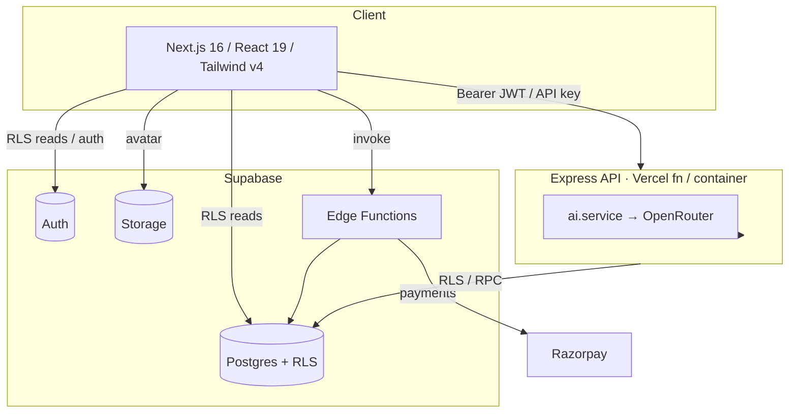

# Neural Shield AI — Project Blueprint

The single architectural reference for the system. Per-area detail lives in the sibling docs;
this is the map that ties them together.

## 1. System overview

Neural Shield AI detects scams/fraud (Indian-market focus) across 7 input types. A Next.js
app talks to a Supabase backend (auth, Postgres+RLS, storage, edge functions) for state and
to a TypeScript Express API for AI analysis. Analysis runs through OpenRouter with a
multi-model fallback chain and strict output normalization. Billing is Razorpay via an edge
function. Everything that touches data is enforced by Row-Level Security.

## 2. Frontend architecture
See [frontend.md](frontend.md). App Router + React Compiler; Tailwind v4 tokens in
`globals.css`; route protection in `proxy.ts`; TanStack Query + Zustand; typed scan client
(axios + fetch for multipart); RLS reads via supabase-js. Static landing/auth pages, dynamic
authenticated dashboard.

## 3. Backend architecture
See [backend.md](backend.md). Express 4 (CJS), shared `createApp()` for server + serverless.
Middleware chain: helmet (CSP) → CORS → json → rate-limit → authenticate → validate (Zod) →
controller → services. Uniform response envelope; central error handler; Winston logging.
Operates under the user's JWT (RLS) — no service-role key.

## 4. Database architecture
See [database.md](database.md). 7 tables (profiles, scans, scan_flags, subscriptions,
feedback, audit_logs, api_keys) + avatars storage. RLS on all; CHECK-constrained enums; FK
cascades from profiles/auth.users; hot-path indexes. Schema versioned in
`supabase/migrations/0001..0007`.

## 5. Security architecture
See [security.md](security.md) and [authentication.md](authentication.md). Defence in depth:
route guards → plan gates → **RLS (the real boundary)** → privilege minimization (no
service-role key in the API; secrets isolated in edge functions; API keys hashed). Helmet CSP,
CORS allow-list, Zod validation + tag-stripping, rate limits, daily metering, hardened
SECURITY DEFINER RPCs.

## 6. AI architecture
See [ai-system.md](ai-system.md). OpenRouter chat completions, ordered model fallback,
JSON-mode, low temperature, `AbortController` timeout. Defensive `extractJson` + `normalize`
guarantee a valid `ScanResult` regardless of model output. Graded outputs (probability, trust
score, risk level, typed flags). Roadmap: blend with a deterministic heuristic for an explicit
confidence/hallucination guard.

## 7. Deployment architecture
See [deployment.md](deployment.md) and [devops.md](devops.md). Vercel for frontend + backend
function (container host available and recommended for OCR). Supabase for DB/auth/storage/edge.
GitHub Actions CI (type-check, lint, test, build) on both apps. Migrations + edge functions
deployed via the Supabase CLI; the repo is the source of truth.

## 8. Cross-cutting contracts

- **Scan contract** — `ScanResult`/`SavedScan` shared (by convention) between
  `backend/src/types` and `frontend/src/types`. Keep them in sync; a generated client or a
  shared package is a future improvement.
- **API envelope** — `{ success, message, data|details, timestamp }` everywhere.
- **Plans** — `free | pro | business` gate features (image scanners = pro+, API = business),
  enforced at the route *and* the database.

## 9. Build phases (history)
Design system → landing → Supabase Auth → scanner engine → dashboard → profile → CI/CD, plus
API keys, image scanners (OCR/QR), and Razorpay billing. Deviations from the original spec are
recorded in [`DECISIONS.md`](../DECISIONS.md) (D1: Next 16 + Tailwind v4; D2: Supabase Auth;
D7: Express 4 + TS; D9: API keys / OCR / billing).

## 10. Future roadmap

**Near term (production-hardening)**
- Commit the working tree; remove the stale JS prototype; rotate the OpenRouter key + scrub
  history.
- Enable leaked-password protection; apply `0007` bucket hardening.
- Move rate-limit state to Redis; make daily metering a SECURITY DEFINER `consume_scan()`.
- Add authz/RLS tests + Playwright E2E; add gitleaks + dependency audit to CI.

**Mid term (product)**
- Confidence scoring (model × heuristic blend) + per-type guardrails.
- Server-side dashboard aggregation + history pagination.
- Feedback loop wired into the UI (the `feedback` table exists) to track accuracy.
- Webhooks / a public API surface for Business beyond per-scan keys; usage analytics.

**Long term**
- Threat-intelligence enrichment (URL reputation, UPI/phone deny-lists) blended with the LLM.
- Multi-language OCR + regional scam-pattern packs.
- Org/team accounts, role-based access, SSO for Business.
