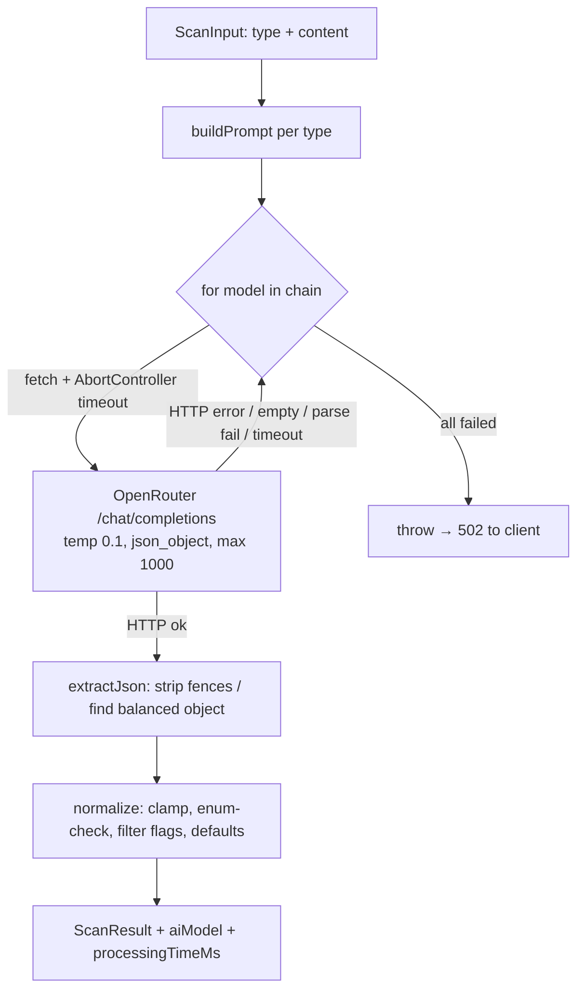

# AI System — Neural Shield AI

The analysis engine lives in `backend/src/services/ai.service.ts`. It calls **OpenRouter**
chat completions with an ordered **model fallback chain**, requests JSON-mode output, then
**defensively normalizes** the response into a strict `ScanResult`.

## Pipeline

## Models & configuration

Default chain (override via `OPENROUTER_MODELS`):
`anthropic/claude-3.5-haiku → openai/gpt-4o → openai/gpt-4o-mini`.

> The current dev OpenRouter account lacks `claude-3.5-haiku`, so it falls through to
> `openai/gpt-4o` — the fallback chain is what keeps analysis working. When provisioning,
> prefer the latest capable models your account can access.

| Setting | Value | Why |
| --- | --- | --- |
| `temperature` | 0.1 | deterministic, consistent scoring |
| `response_format` | `json_object` | structured output |
| `max_tokens` | 1000 | bounded cost/latency |
| `OPENROUTER_TIMEOUT_MS` | 25000 | per-model timeout (under Vercel's 60s ceiling) |

## Prompt design

A fixed **system prompt** casts the model as an Indian-market fraud analyst, pins the exact
JSON schema, enumerates scam types (phishing, advance_fee, fake_investment, lottery_fraud,
tech_support, romance_scam, impersonation, fake_kyc, upi_fraud, job_fraud, loan_fraud,
delivery_scam), and biases toward caution ("false positives are better than missed scams").
A per-type **user prompt** wraps the content (message/url/email/phone/upi/qr/screenshot).

## Reliability & safety controls

- **Retry / failover** — every model in the chain is tried in order; the first to return
  valid JSON wins. HTTP errors, empty content, parse failures, and **timeouts** all fail over
  to the next model. If all fail, the controller returns a clean `502` (never a 500/stack).
- **Timeout handling** *(added in this audit)* — each upstream call is wrapped in an
  `AbortController`; an abort is logged as a timeout and treated as a model failure.
- **Structured-output validation** — `extractJson` tolerates code fences and surrounding
  prose (finds the first balanced `{...}`). `normalize`:
  - clamps `scamProbability` to `[0,1]` (fallback 0.5) and `trustScore` to `[0,100]`
    (rounded, fallback 50);
  - coerces an unknown `riskLevel` to `medium` and an unknown flag `severity` to `warning`;
  - filters non-object flags; coerces `scamType` null; supplies safe default text.
  → **Untrusted model output can never change the response *shape* or break the client.**
- **Prompt-injection posture** — content is data, analyzed under a fixed instruction set with
  JSON-mode and strict post-validation, so injected "ignore previous instructions" text
  cannot alter the output contract. Residual risk: a crafted message could bias the *score*.
  Mitigations in place: low temperature, schema pinning, caution bias. Future hardening:
  cross-check with deterministic heuristics (see below) and add per-type guardrails.

## Confidence & scoring model

The result already carries graded signals: `scamProbability` (0–1), `trustScore` (0–100),
`riskLevel` (safe→critical), and typed `flags`. The frontend derives "scams caught" from
`risk_level in (high, critical)`.

**Recommended enhancement (roadmap):** compute a deterministic heuristic score
(`frontend/src/lib/demo-analyze.ts` already implements one for the landing demo) and blend it
with the model score, exposing an explicit `confidence` field = agreement between the two.
Disagreement (model says safe, heuristic flags a known pattern) is a strong "review" signal
and a hallucination guard.

## Cost & latency

- One scan = one successful model call (≤1000 output tokens, temp 0.1). Failover adds the
  latency of failed attempts only when a model errors.
- `processing_time_ms` is recorded per scan for observability (see [performance.md](performance.md)).
- To cap spend: keep `max_tokens` tight, prefer cheaper models earlier in the chain for
  high-volume text scans, and consider caching identical inputs (hash of normalized content).

## Testing

`backend/tests/ai.test.ts` covers the pure, deterministic core (`clampNumber`, `extractJson`,
`normalize`) — including fenced/prose JSON, out-of-range clamping, enum fallback, and
malformed-flag filtering. The network call itself is integration-tested manually (see
DECISIONS D6: the SBI-KYC sample scores 0.95 / critical).
