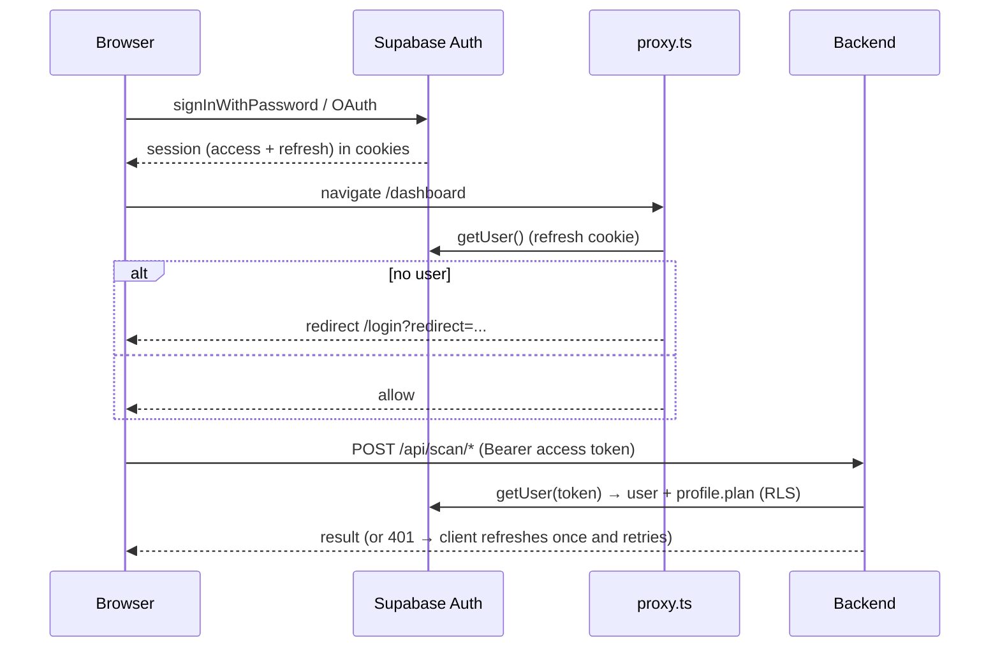

# Authentication & Authorization — Neural Shield AI

**Model:** Supabase Auth (decision D2), **not** custom JWT/bcrypt. Credentials live in
`auth.users` (managed by Supabase/GoTrue). The app never stores or hashes passwords itself —
password storage, reset, OAuth, and session rotation are Supabase's responsibility. A public
`profiles` row (1:1) holds plan, counters, preferences.

> Why not custom JWT + bcrypt? The original spec mixed self-minted JWTs with RLS policies
> keyed on `auth.uid()`. A self-signed JWT never populates `auth.uid()`, so those policies
> would never match. Supabase Auth makes the RLS policies work as written and adds OAuth.

## Actors & credentials

| Actor | Credential | Verified by | Authorization |
| --- | --- | --- | --- |
| Web user | Supabase access token (JWT) in `Authorization: Bearer` | `supabase.auth.getUser(token)` | RLS (`auth.uid()`) + `requirePlan` |
| Business integration | API key `nsk_live_<48hex>` (`X-API-Key` or `nsk_` Bearer) | SHA-256 hash → `app_verify_api_key` RPC | must be `plan = business` |
| Edge functions | platform `verify_jwt` + service role | Supabase runtime | service role (server-only) |
| Local dev | none | dev bypass (non-prod, Supabase unconfigured) | fixed dev user |

## Web login flow

- **Session handling**: `@supabase/ssr` stores the session in cookies; `proxy.ts` refreshes
  it on every request; `lib/api.ts` attaches the access token and transparently refreshes
  once on a 401.
- **Profile provisioning**: the `on_auth_user_created` trigger inserts a `profiles` row on
  signup (name/avatar pulled from OAuth metadata).

## API-key flow (Business)

1. User (Business plan) generates a key in the UI. The browser creates `nsk_live_<48 hex>`,
   computes its SHA-256, and stores **only** `{key_prefix, last_four, key_hash}` in
   `api_keys`. The full secret is shown once and never persisted.
2. A request presents the key; the backend hashes it and calls `app_verify_api_key(hash)`
   (SECURITY DEFINER) which returns the owner+plan and stamps `last_used_at`.
3. Non-business keys are rejected (403). Revocation is a soft-delete (`revoked_at`), checked
   inside the RPC.

## Authorization layers (defence in depth)

1. **Route guards** — `proxy.ts` (frontend) and `authenticate` + `requirePlan` (backend).
2. **Plan gates** — image scanners require `pro|business`; API access requires `business`.
3. **RLS** — the real boundary. Even if app code is wrong, Postgres only returns/accepts a
   user's own rows because every query runs under their JWT.
4. **Privilege minimization** — the backend holds **no service-role key**; privileged
   operations (account deletion, plan upgrade) are isolated in edge functions.

## Password & account security

- Password strength meter on signup (`components/auth/PasswordStrength.tsx`,
  `lib/password.ts`); change-password and **sign-out-everywhere** (`scope: 'global'`) in
  profile Security.
- Account deletion via the `delete-account` edge function (service role → `admin.deleteUser`
  → FK cascade).
- **Recommended (advisor):** enable Supabase **leaked-password protection** (HaveIBeenPwned)
  in Auth settings — currently disabled. See [security.md](security.md).

## Dev bypass (safety)

`authenticate` allows a fixed dev user **only** when Supabase is unconfigured **and**
`NODE_ENV !== 'production'`. In production with Supabase unconfigured it returns `503`, never
an open door. This is what lets the scanner be exercised locally without a Supabase project.
