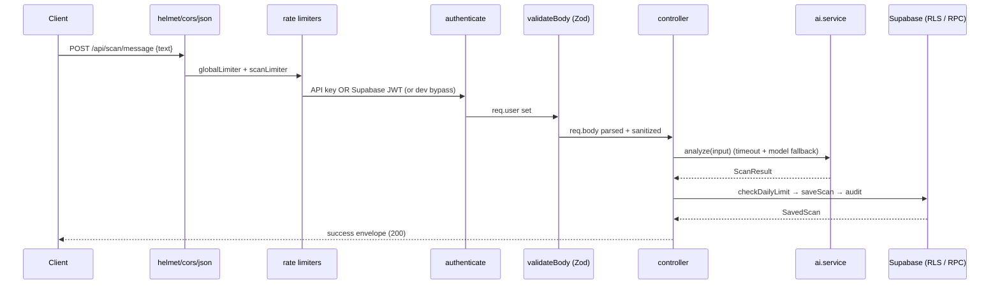

# Backend Architecture — Neural Shield AI

TypeScript on **Express 4** (CommonJS). Runs as a long-lived server locally/containers
(`src/server.ts`) and as a **Vercel serverless function** (`api/index.ts`). The app factory
`createApp()` is shared by both entries.

## Request flow



## Route map

| Method | Path | Auth | Plan | Validation | Handler |
| --- | --- | --- | --- | --- | --- |
| GET | `/api/health` | none | — | — | health |
| POST | `/api/scan/message` | JWT or API key | any | `MessageScanSchema` | `scanMessage` |
| POST | `/api/scan/url` | JWT or API key | any | `UrlScanSchema` | `scanUrl` |
| POST | `/api/scan/email` | JWT or API key | any | `EmailScanSchema` | `scanEmail` |
| POST | `/api/scan/phone` | JWT or API key | any | `PhoneScanSchema` | `scanPhone` |
| POST | `/api/scan/upi` | JWT or API key | any | `UpiScanSchema` | `scanUpi` |
| POST | `/api/scan/screenshot` | JWT or API key | pro/business | multipart image ≤10MB | `scanScreenshot` |
| POST | `/api/scan/qr` | JWT or API key | pro/business | multipart image ≤10MB | `scanQr` |

All `/api/scan/*` routes run `authenticate` then `scanLimiter` (`router.use`), then their
per-route validator. `/api` as a whole runs `globalLimiter`.

## Layering

```
routes/        Express routers; wire middleware → controller
controllers/   thin orchestration (scan.controller.ts): limit → analyze → persist → respond
services/      business logic:
               ├─ ai.service.ts        OpenRouter call, parse, normalize  (pure helpers exported)
               ├─ scan.service.ts      daily limit, saveScan, audit (RLS client)
               ├─ supabase.service.ts  JWT verify, API-key RPCs, RLS client factory
               └─ extract.service.ts   OCR (Tesseract worker) + QR decode (Jimp+jsQR)
middleware/    auth, validate (Zod), rateLimit, upload (multer), error
schemas/       Zod request schemas (also exported as TS types)
utils/         logger (Winston), response (success/failure envelopes)
config/        env parsing + feature flags (isAiConfigured, isSupabaseConfigured)
types/         shared contract + Express Request augmentation
```

## API design conventions

- **Uniform envelope** (`utils/response.ts`):
  - success → `{ success: true, message, data, timestamp }`
  - failure → `{ success: false, message, details, timestamp }`
- **Status codes**: 400 validation, 401 unauthenticated, 403 wrong plan, 404 unmatched,
  429 rate-limit / daily-limit, 502 AI failure, 500 unexpected, 503 auth not configured.
- **No leaking internals**: the central error handler logs the real error (with stack) and
  returns a generic message to the client.
- **Typed everywhere**: `strict` tsconfig, `noUnusedLocals/Parameters`, ESLint flat config.

## Authentication paths (see [authentication.md](authentication.md))

1. **Supabase JWT** (web): `Authorization: Bearer <access_token>` → `verifyToken` →
   `auth.getUser` + RLS profile read → `req.user`, `req.userToken`.
2. **API key** (Business): `X-API-Key: nsk_...` or `nsk_`-prefixed Bearer → SHA-256 hash →
   `app_verify_api_key` RPC → `req.user`, `req.apiKeyHash`. 403 unless plan = business.
3. **Dev bypass**: only when Supabase is unconfigured **and** `NODE_ENV !== production` —
   a fixed dev user so the scanner runs locally. Hard-disabled in production (returns 503).

## Persistence model

- Web (JWT) scans persist via a **request-scoped RLS client** built from the user's token
  (`getUserClient`) — every insert runs as that user; RLS enforces tenancy.
- API-key scans persist via the `app_record_api_scan` SECURITY DEFINER RPC (the backend has
  no service-role key; key possession is the authorization, re-checked inside the function).
- Free-tier metering (`checkAndConsumeDailyLimit`) reads/increments `profiles.daily_scan_count`
  with a 24h reset window; no-op for pro/business and in dev (no DB).

## Robustness changes applied in this audit

- **AI request timeout**: each upstream OpenRouter call is wrapped in an `AbortController`
  (`OPENROUTER_TIMEOUT_MS`, default 25s, under Vercel's 60s ceiling). A timeout fails over to
  the next model in the chain instead of hanging.
- Exported `clampNumber` / `extractJson` / `normalize` for unit testing.

## Run & build

```bash
cd backend
npm install
cp .env.example .env      # fill OPENROUTER_API_KEY, SUPABASE_URL, SUPABASE_ANON_KEY
npm run dev               # tsx watch, port 5000
npm run type-check && npm run lint && npm test && npm run build
```
