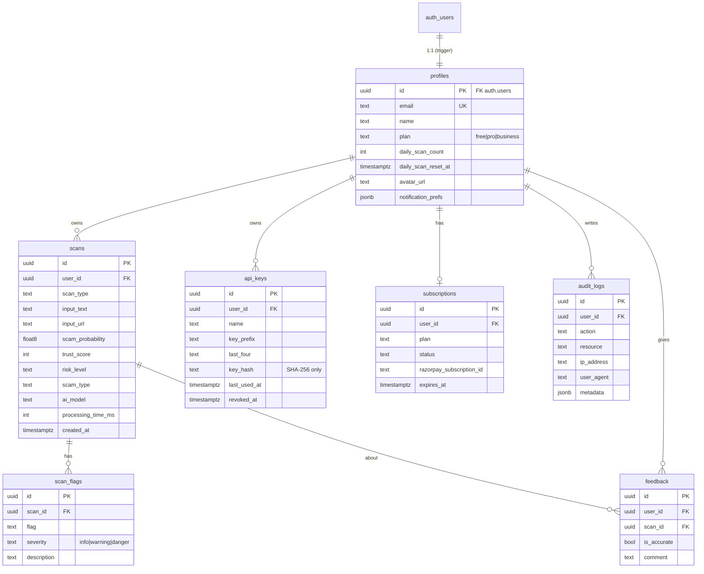

# Database Architecture — Neural Shield AI

Supabase **Postgres** (project `jdcilinhabwilvbrjwjp`, ap-southeast-1). Auth model is
Supabase Auth (decision D2): credentials live in `auth.users`; a 1:1 `public.profiles` row
holds app data and is auto-created by a trigger. **RLS is enabled on every public table.**

The full schema history is versioned in [`supabase/migrations/`](../supabase/migrations):

| File | Purpose |
| --- | --- |
| `0001_init.sql` | Tables, indexes, triggers, RLS policies |
| `0002_harden_security_definer_functions.sql` | Lock `search_path`; revoke `handle_new_user` from API roles |
| `0003_profile_settings_notifications_and_api_keys.sql` | `notification_prefs`, `api_keys` table |
| `0004_avatars_storage_bucket.sql` | `avatars` bucket + own-folder RLS |
| `0005_api_key_auth_functions.sql` | `app_verify_api_key`, `app_record_api_scan` RPCs |
| `0006_lock_plan_column_from_users.sql` | Revoke `plan` UPDATE from users (anti-self-upgrade) |
| `0007_harden_avatars_bucket_listing.sql` | *(optional, not yet applied)* drop broad bucket listing |

> Migrations `0002–0007` were captured into the repo during this audit (they previously
> existed only in the live project). The repo is now the source of truth — apply future
> changes as migration files, not ad-hoc.

## ER diagram

## Tables & constraints

- **CHECK constraints** enforce enums at the DB: `profiles.plan`, `scans.scan_type`,
  `scans.risk_level`, `scan_flags.severity`, `subscriptions.status`.
- **Foreign keys** cascade from `profiles` (and `auth.users`) — deleting a user via the
  `delete-account` edge function cascades to scans, flags, api_keys, audit_logs.
  `feedback` uses `on delete set null` to preserve aggregate feedback history.
- **Uniqueness**: `profiles.email`, `subscriptions.user_id`.

## Indexes

| Index | Table | Rationale |
| --- | --- | --- |
| `scans_user_id_created_at (user_id, created_at desc)` | scans | history/dashboard hot path |
| `scan_flags_scan_id` | scan_flags | join flags to a scan |
| `audit_logs_user_id (user_id, created_at desc)` | audit_logs | per-user audit reads |
| `api_keys_user (user_id, created_at desc)` | api_keys | list a user's keys |

Primary keys are UUID (`uuid_generate_v4()` / `auth.users.id`).

## Row-Level Security (summary)

| Table | Policy |
| --- | --- |
| profiles | select/update own row; `plan` UPDATE revoked from users (D9) |
| scans | full CRUD where `auth.uid() = user_id` |
| scan_flags | scoped via the parent scan's owner |
| subscriptions | owner-only |
| feedback | owner can create/read own |
| audit_logs | select **and insert** own (insert added in this audit) |
| api_keys | owner-only CRUD |
| storage.objects (avatars) | public read; insert/update/delete only in `{uid}/` folder |

## SECURITY DEFINER functions (intentional, gated)

- `handle_new_user()` — trigger only; EXECUTE revoked from API roles.
- `set_updated_at()` — trigger; `search_path` pinned to `''`.
- `app_verify_api_key(p_hash)` / `app_record_api_scan(...)` — the API-key path. `search_path`
  locked, all refs schema-qualified, key hash re-verified inside. These are intentionally
  callable by `anon`/`authenticated` because **possession of the key hash is the
  authorization** — see the advisor note in [security.md](security.md).

## Optimization notes

- The dashboard pulls up to 1000 scans and aggregates client-side. As volume grows, move
  aggregates to a Postgres view / RPC (`group by risk_level, scan_type`) and paginate history
  server-side (the `(user_id, created_at desc)` index already supports keyset pagination).
- Consider a partial index on `scans (user_id, created_at desc) where risk_level in
  ('high','critical')` if "threats only" views become common.
- `daily_scan_count` is currently user-updatable (needed by the metering update). A
  hardening follow-up: move metering into a SECURITY DEFINER `consume_scan()` so free users
  cannot reset their own counter (noted in DECISIONS / memory).
