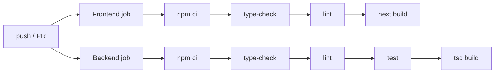

# DevOps / CI-CD — Neural Shield AI

## Continuous Integration

`.github/workflows/ci.yml` runs two parallel jobs on push (to `main`/`develop`/dev branches)
and PRs (to `main`/`develop`), with `concurrency` cancellation of superseded runs.

| Job | Steps | Node | Cache |
| --- | --- | --- | --- |
| Frontend | `npm ci` → `type-check` → `lint` → `build` (with public `NEXT_PUBLIC_*` envs) | 20 | npm, keyed on `frontend/package-lock.json` |
| Backend | `npm ci` → `type-check` → `lint` → `test` → `build` | 20 | npm, keyed on `backend/package-lock.json` |

**Improvement landed in this audit:** the backend `test` step is now a real `node:test`
suite (previously a no-op echo), so CI actually exercises the AI normalization, Zod schemas,
and the HTTP envelope. Node 20 is required for `node --import tsx --test`.

## Recommended CI additions (follow-up)

- **Secret scanning** — add `gitleaks` to prevent re-committing secrets (an OpenRouter key was
  previously committed; see [security.md](security.md)).
- **Dependency audit** — `npm audit --omit=dev` (non-blocking) or Dependabot.
- **Supabase advisors** — a scheduled job (or manual gate) running the security/performance
  advisors after any migration.
- **Coverage gate** — once authz/RLS tests land, fail under a threshold on `services/` +
  `schemas/`.
- **Preview deploys** — Vercel already builds PR previews for the frontend; wire the backend
  preview URL into the frontend preview env for full-stack preview testing.

## Continuous Deployment

| Target | Trigger | Mechanism |
| --- | --- | --- |
| Frontend (Vercel) | push to `main` | Vercel Git integration → `next build` |
| Backend (Vercel) | push to `main` | Vercel Git integration → serverless function (`api/index.ts`) |
| Database (Supabase) | manual / CLI | `supabase db push` of `supabase/migrations/*` |
| Edge functions | manual / CLI | `supabase functions deploy <name>` |

> DB and edge-function deploys are intentionally **manual/gated** (schema changes deserve a
> human). Keep the repo migrations as the source of truth and apply them with the CLI rather
> than ad-hoc dashboard edits — that drift is exactly what this audit had to reconcile.

## Local containers

`docker-compose.dev.yml` brings up the backend (and supporting services) for local
full-stack work; `backend/Dockerfile` is a hardened multi-stage build (see
[deployment.md](deployment.md)). `railway.toml` is ready for a container host (recommended
for reliable OCR).

## Environments

| Env | Frontend | Backend | DB |
| --- | --- | --- | --- |
| Local | `next dev` (3000) | `tsx watch` (5000) or compose | live Supabase or none (dev bypass) |
| Preview | Vercel PR preview | Vercel preview function | live Supabase (shared) |
| Production | Vercel `main` | Vercel `main` function (or container host) | Supabase `jdcilinhabwilvbrjwjp` |
