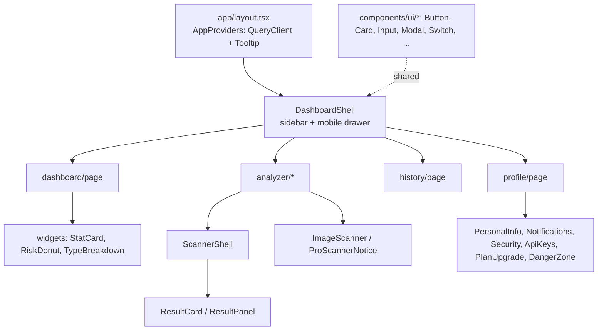

# Frontend Architecture — Neural Shield AI

Next.js **16.2.9** (App Router, React 19, React Compiler enabled), Tailwind **v4** (no
`tailwind.config.ts` — tokens live in `src/app/globals.css` via `@theme`, per decision D1).
State: TanStack Query (server cache) + Zustand (UI/session). Data: `supabase-js` directly
for reads/profile (RLS), axios for the scan API.

> ⚠️ **Next 16 note:** this is not the Next.js most references assume. Middleware is renamed
> to **proxy** (`src/proxy.ts`, exported `proxy`). See `frontend/AGENTS.md`.

## Routing map

```
app/
├─ (landing)        page.tsx  "/"           NeuralOrb, HeroScanPreview, RiskDemo (local heuristic)
├─ (auth)/
│  ├─ login                 /login          ← redirected here if unauthenticated
│  ├─ signup                /signup
│  └─ forgot-password       /forgot-password
├─ auth/callback/route.ts   /auth/callback  OAuth + email code exchange
└─ (dashboard)/             protected by proxy.ts
   ├─ dashboard             /dashboard      stats widgets
   ├─ analyzer              /analyzer       + /analyzer/{message,url,email,phone,upi,screenshot,qr}
   ├─ history               /history        filter/search/paginate/CSV/bulk-delete
   └─ profile               /profile        personal info, notifications, security, API keys, danger zone
```

**Route protection** (`src/proxy.ts`): refreshes the Supabase cookie on every request;
unauthenticated users hitting `/dashboard|/analyzer|/history|/profile` are bounced to
`/login?redirect=…`; authenticated users on `/login|/signup` are bounced to `/dashboard`.
When Supabase env is absent, navigation is not blocked (the app degrades gracefully).

## Component hierarchy (high level)



## Data flow

```mermaid
flowchart LR
  subgraph Reads (RLS, direct)
    Q[useScans → fetchScans] -->|supabase-js| DB[(scans + scan_flags)]
    Q --> Stats[computeStats / scansToCsv]
  end
  subgraph Writes (scan API)
    Panel[scanner page] --> Hook[useScanner.run] --> Svc[services/scanner] --> Axios[lib/api axios]
    Axios -->|Bearer JWT| API[(backend /api/scan/*)]
    Hook -->|on success| Inval[queryClient.invalidate scans]
  end
```

- **`lib/api.ts`** — axios instance; request interceptor attaches the current Supabase access
  token; response interceptor refreshes the session once on a 401 and retries.
- **`services/scanner.ts`** — typed scan client; JSON for text, `fetch` + `FormData` for image
  uploads (so the browser sets the multipart boundary); errors normalized to `ScanError`.
- **`hooks/useScanner.ts`** — drives one panel (loading/result/error); invalidates the `scans`
  query on a persisted result so dashboard + history refresh.
- **`lib/scans.ts`** — RLS reads + client-side `computeStats`, `scanPreview`, `scansToCsv`.
- **`lib/profile.ts`** — name/avatar/notifications/password, account deletion (edge fn), API
  keys (generates `nsk_live_<48hex>`, stores only the SHA-256 hash).
- **`lib/billing.ts`** — Razorpay checkout via the `razorpay-checkout` edge function.

## State management

| Concern | Tool |
| --- | --- |
| Auth session / cookies | `@supabase/ssr` (browser + server clients), refreshed in `proxy.ts` |
| Server data cache (scans, profile) | TanStack Query (`AppProviders`) |
| Local UI/session flags | Zustand (`store/useAppStore.ts`) |
| Single-panel scan state | local `useState` in `useScanner` |

## UX states & accessibility

- Loading: `Spinner`, `Skeleton`, `Progress`; result panels animate in (framer-motion).
- Errors: backend's human message surfaced via `ScanError`; daily-limit (429) shows an upgrade
  prompt; "Supabase not configured" guidance when env is missing.
- Primitives wrap Radix (Dialog, Tooltip, Slot) → focus management and ARIA come for free;
  `Label`/`Input` association, keyboard-operable `Switch`/`Checkbox`.
- Responsive: sidebar collapses to a mobile drawer in `DashboardShell`; Tailwind breakpoints.

## SEO & rendering

- Landing (`/`), `/login`, `/signup`, `/forgot-password` are **static** (prerendered).
- Dashboard routes are **dynamic** (server-rendered on demand) and behind auth.
- Metadata in `app/layout.tsx`; security headers in `next.config.ts` `headers()` (mirrored in
  `vercel.json`).

## Build & verify

```bash
cd frontend
npm install
cp .env.example .env.local   # NEXT_PUBLIC_SUPABASE_URL/ANON_KEY, NEXT_PUBLIC_API_URL
npm run dev
npm run type-check && npm run lint && npm run build   # all green
```
