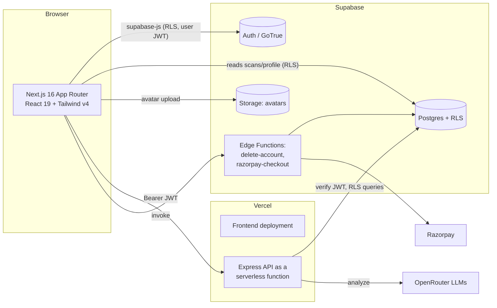

# Neural Shield AI — Project Audit (Phase 1: Discovery)

> Production-readiness audit. Generated from a full read of the working tree, the live
> Supabase project (`jdcilinhabwilvbrjwjp`), and the deployed Vercel functions.
> Companion docs live alongside this file in `docs/`; the consolidated scorecard is in
> [`final-audit-report.md`](final-audit-report.md).

## 1. What Neural Shield AI is

An AI-powered scam/fraud detection product for the Indian market. Users submit a
message, URL, email, phone number, UPI ID, screenshot, or QR code; the backend runs it
through an LLM (via OpenRouter, multi-model fallback) and returns a structured risk
analysis (scam probability, trust score, risk level, typed flags, recommendation). Results
are persisted per-user and surfaced in a dashboard with history, stats, profile/settings,
and Business API keys.

## 2. Current architecture



- **Frontend** — Next.js 16.2.9 (App Router, React 19, React Compiler on), Tailwind v4
  (tokens in `globals.css` via `@theme`), TanStack Query, Zustand, Supabase SSR auth,
  axios. Route protection via `src/proxy.ts` (Next 16 renamed middleware → proxy).
- **Backend** — TypeScript on Express 4 (CommonJS). Helmet (CSP), CORS, express-rate-limit,
  Winston, Zod, multer. Runs both as a long-lived server (`src/server.ts`) and as a Vercel
  serverless function (`api/index.ts`). Operates under each user's JWT (RLS) — **no
  service-role key**.
- **AI** — `ai.service.ts`: OpenRouter chat completions with an ordered model fallback
  chain, JSON-mode response, defensive parsing/normalization.
- **Database** — Supabase Postgres. 7 public tables + storage + 2 edge functions, RLS on
  every table, SECURITY DEFINER RPCs for the API-key path.
- **Deploy** — Vercel (frontend + backend). Container path (Dockerfile + `railway.toml`)
  ready as an alternative host, recommended for reliable OCR.

## 3. Repository structure (source, excluding `node_modules`)

```
neural-shield-ai/
├─ frontend/                 Next.js app
│  └─ src/{app,components,hooks,lib,services,store,types}  + proxy.ts
├─ backend/
│  ├─ src/{config,controllers,middleware,routes,schemas,services,types,utils}
│  ├─ api/index.ts           Vercel serverless entry
│  ├─ tests/                 node:test unit + API tests   (added in this audit)
│  ├─ Dockerfile, railway.toml, vercel.json
├─ supabase/
│  ├─ migrations/0001..0007  full schema history          (0002–0007 added in this audit)
│  └─ functions/{delete-account,razorpay-checkout}        (captured in this audit)
├─ .github/workflows/ci.yml
├─ docker-compose.dev.yml
├─ docs/                     this audit set                (added in this audit)
├─ DECISIONS.md, README.md
```

## 4. Existing features (verified present in code)

- 5 text scanners (message, URL, email, phone, UPI) — full pipeline, Zod-validated.
- 2 image scanners (screenshot OCR via Tesseract, QR decode via Jimp+jsQR) — Pro-gated.
- Supabase Auth (email + OAuth), profile auto-provisioning trigger, RLS throughout.
- Dashboard (stats, risk donut, type breakdown), history (filter/search/paginate/CSV/bulk
  delete), profile/settings (avatar, name, notifications, password, sign-out-everywhere,
  delete account), Business API keys (hash-only storage), Razorpay billing (edge function).
- Free-tier daily scan metering; per-user + per-IP rate limiting.
- Security headers, CSP, CORS allow-list, standard response envelope, central error handler.

## 5. Missing / incomplete (before this audit)

| Gap | Status after audit |
| --- | --- |
| **Production code uncommitted** — git HEAD is the old JS prototype; the whole TS rewrite is untracked | ⚠️ Still requires a commit by the user (see §7) |
| **DB migration drift** — 5 of 6 live migrations + both edge functions existed only in Supabase | ✅ Captured into `supabase/migrations/0002–0006` + `supabase/functions/*` |
| **No automated tests** — backend `test` was a no-op echo | ✅ Added `node:test` unit + API suite (25 tests) |
| **No AI request timeout** — a hung OpenRouter call blocked up to 60s | ✅ Added `AbortController` timeout + failover |
| Missing `audit_logs` INSERT RLS policy in the committed `0001` migration | ✅ Added (backend writes audit rows under the user JWT) |
| Junk `tmpfile`; 5 MB `eng.traineddata` blob eligible for git | ✅ Removed / gitignored |
| Secret (OpenRouter key) in git history | ⚠️ User must rotate + scrub (see [security.md](security.md)) |

## 6. Technical debt & smaller findings

- `config.supabase.serviceRoleKey` is read but never used by the backend (it is RLS-only).
  Harmless; documented in `.env.example`.
- Stale tracked prototype files (`backend/server.js`, `routes/analyze.js`,
  `services/aiService.js`, `frontend/src/components/{analyzer,layout/Hero,layout/Navbar}`,
  `services/services/analyze.ts`) are superseded by the rewrite and should be removed in the
  same commit that lands the new tree.
- Frontend has no test suite (logic is thin; the risk lives in the backend + DB, which are
  now covered). E2E (Playwright) is recommended as a follow-up — see [testing.md](testing.md).
- OCR on Vercel serverless is unreliable (cold filesystem + model fetch); use the container
  host for the image scanners.

## 7. Top risks (ranked)

1. **Source-control risk (highest).** The deployed, working application is not committed.
   A lost working tree = lost product. **Action:** review and commit the working tree (the
   audit has cleaned junk and captured all infra). This is the single most important step.
2. **Leaked secret.** The OpenRouter key is in git history. **Action:** rotate the key and
   scrub history (`git filter-repo`) before sharing the repo.
3. **Schema/edge drift (now mitigated).** Keep the repo as the source of truth: apply future
   DB changes as migration files, not ad-hoc via the dashboard/MCP.
4. **OCR reliability on serverless.** Run image scanners on the container host.

## 8. Deployment & scalability snapshot

- Stateless backend → horizontally scalable; rate-limit state is per-instance (in-memory) —
  fine for a single Vercel function, but move to a shared store (Redis/Upstash) if you run
  multiple backend instances. See [performance.md](performance.md).
- DB is indexed on the hot path (`scans(user_id, created_at desc)`). RLS keeps tenant
  isolation at the database. The dashboard fetches up to 1000 scans client-side and
  aggregates in the browser — fine now, paginate/aggregate server-side as data grows.

See the per-phase docs for detail and [`final-audit-report.md`](final-audit-report.md) for the
scorecard.
