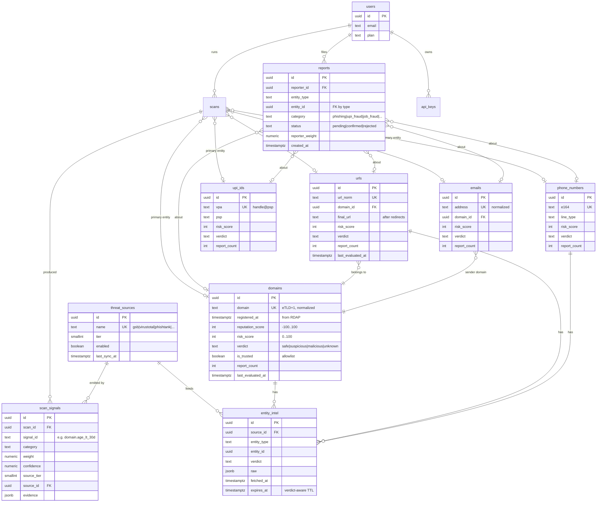

# Reputation Database

> **Task 7 deliverable.** Schema, indexes, relationships, and ER diagram for the
> reputation/evidence layer that the engine reads and writes. Extends the existing
> Supabase schema (`supabase/migrations/0001_init.sql`) — it does **not** replace
> `profiles`/`scans`/`scan_flags`. Fixes F-DB-1 (no reputation state) and F-DB-2
> (verdicts unauditable). Consumed by [`trust-engine-architecture.md`](trust-engine-architecture.md).

---

## 1. Design decisions

1. **`users` already exists as `public.profiles`** (1:1 with `auth.users`). This doc
   keeps that name in the ER diagram for the requested "users" table but the DDL uses
   `profiles` to match the repo. No churn to auth.
2. **Reputation is shared, not per-user.** Today every table is RLS-scoped to the
   owner (`0001`). Reputation must be cross-user ("47 people reported this UPI"). So
   the entity/reputation tables are **read-public (or read-via-RPC), write-via-RPC
   only** — never directly writable by a user's RLS client. Writes go through
   `SECURITY DEFINER` functions (same hardening pattern as migration 0002/0005),
   which apply anti-abuse rules. This preserves the repo's "backend holds no
   service-role key" posture.
3. **One normalized entity table per type** (as Task 7 lists) so each can carry
   type-specific columns and its own reputation. A polymorphic single-table design was
   rejected for weaker constraints and index bloat.
4. **Evidence is persisted** (`scan_signals`) so any verdict is reproducible (F-DB-2).
5. **Reputation is derived + cached**: raw inputs are `reports` + `scan_signals` +
   TI hits; the per-entity `reputation_score` / `risk_score` columns are materialized
   by the reputation engine for O(1) reads ([`trust-engine-architecture.md`](trust-engine-architecture.md) §8).

---

## 2. ER diagram



---

## 3. DDL (new migration `0008_reputation_engine.sql`)

```sql
-- Shared reputation tables. WRITE only via SECURITY DEFINER RPCs (anti-abuse).
-- READ: public verdict columns are safe to expose; raw reports are not.

create type entity_kind as enum ('domain','url','email','phone','upi','ip','text_hash');
create type verdict_kind as enum ('safe','suspicious','malicious','unknown');
create type report_status as enum ('pending','confirmed','rejected');

-- ── threat sources registry ────────────────────────────────────────────────
create table public.threat_sources (
  id uuid primary key default uuid_generate_v4(),
  name text unique not null,                 -- gsb, virustotal, phishtank, urlhaus, openphish, spamhaus, abuseipdb, rdap, reputation, rule_engine
  tier smallint not null check (tier in (1,2,3)),
  enabled boolean not null default true,
  last_sync_at timestamptz,
  created_at timestamptz not null default now()
);

-- ── entity tables (one per type) ───────────────────────────────────────────
create table public.domains (
  id uuid primary key default uuid_generate_v4(),
  domain text unique not null,               -- normalized eTLD+1
  registered_at timestamptz,                 -- RDAP creation date
  registrar text,
  reputation_score int not null default 0 check (reputation_score between -100 and 100),
  risk_score int not null default 0 check (risk_score between 0 and 100),
  verdict verdict_kind not null default 'unknown',
  is_trusted boolean not null default false, -- allowlist
  report_count int not null default 0,
  scan_count int not null default 0,
  last_evaluated_at timestamptz,
  created_at timestamptz not null default now()
);

create table public.urls (
  id uuid primary key default uuid_generate_v4(),
  url_norm text unique not null,
  domain_id uuid references public.domains(id) on delete set null,
  final_url text,                            -- after redirect resolution
  risk_score int not null default 0 check (risk_score between 0 and 100),
  verdict verdict_kind not null default 'unknown',
  report_count int not null default 0,
  last_evaluated_at timestamptz,
  created_at timestamptz not null default now()
);

create table public.emails (
  id uuid primary key default uuid_generate_v4(),
  address text unique not null,
  domain_id uuid references public.domains(id) on delete set null,
  risk_score int not null default 0,
  verdict verdict_kind not null default 'unknown',
  report_count int not null default 0,
  last_evaluated_at timestamptz,
  created_at timestamptz not null default now()
);

create table public.phone_numbers (
  id uuid primary key default uuid_generate_v4(),
  e164 text unique not null,
  line_type text,                            -- mobile|landline|voip|tollfree
  carrier text,
  risk_score int not null default 0,
  verdict verdict_kind not null default 'unknown',
  report_count int not null default 0,
  last_evaluated_at timestamptz,
  created_at timestamptz not null default now()
);

create table public.upi_ids (
  id uuid primary key default uuid_generate_v4(),
  vpa text unique not null,                   -- handle@psp
  psp text,                                   -- okaxis, ybl, paytm...
  risk_score int not null default 0,
  verdict verdict_kind not null default 'unknown',
  report_count int not null default 0,
  last_evaluated_at timestamptz,
  created_at timestamptz not null default now()
);

-- ── community reports (raw reputation input) ───────────────────────────────
create table public.reports (
  id uuid primary key default uuid_generate_v4(),
  reporter_id uuid references public.profiles(id) on delete set null,
  entity_type entity_kind not null,
  entity_id uuid not null,                    -- FK resolved by type in the RPC
  category text not null,                     -- phishing|upi_fraud|job_fraud|lottery|...
  comment text,
  status report_status not null default 'pending',
  reporter_weight numeric not null default 0.3,
  created_at timestamptz not null default now(),
  unique (reporter_id, entity_type, entity_id) -- one report per user per entity (anti-spam)
);

-- ── evidence trail (one row per signal per scan) ───────────────────────────
create table public.scan_signals (
  id uuid primary key default uuid_generate_v4(),
  scan_id uuid not null references public.scans(id) on delete cascade,
  signal_id text not null,                    -- 'domain.age_lt_30d', 'ti.phishtank.verified'
  category text not null,
  weight numeric not null,
  confidence numeric not null,
  source_tier smallint not null,
  source_id uuid references public.threat_sources(id) on delete set null,
  evidence jsonb,                             -- raw proof, e.g. {"createdAt":"2026-06-04","ageDays":4}
  created_at timestamptz not null default now()
);

-- ── per-source cached intel (verdict-aware TTL cache) ──────────────────────
create table public.entity_intel (
  id uuid primary key default uuid_generate_v4(),
  source_id uuid not null references public.threat_sources(id) on delete cascade,
  entity_type entity_kind not null,
  entity_id uuid not null,
  verdict verdict_kind not null default 'unknown',
  raw jsonb,
  fetched_at timestamptz not null default now(),
  expires_at timestamptz not null,
  unique (source_id, entity_type, entity_id)
);

-- columns added to existing scans table for traceability
alter table public.scans add column if not exists risk_score int;
alter table public.scans add column if not exists confidence numeric;
alter table public.scans add column if not exists engine_version text;
alter table public.scans add column if not exists primary_entity_type entity_kind;
alter table public.scans add column if not exists primary_entity_id uuid;
```

---

## 4. Indexes

```sql
-- entity lookups are the hot path (cache check before any API)
create unique index on public.domains (domain);
create unique index on public.urls (url_norm);
create unique index on public.emails (address);
create unique index on public.phone_numbers (e164);
create unique index on public.upi_ids (vpa);

-- "is this risky?" filters + freshness sweeps
create index on public.domains (verdict, risk_score desc);
create index on public.domains (last_evaluated_at);            -- TTL re-eval sweeps
create index on public.urls (domain_id);
create index on public.emails (domain_id);

-- reports: per-entity rollups + moderation queue
create index on public.reports (entity_type, entity_id);
create index on public.reports (status, created_at desc);
create index on public.reports (reporter_id, created_at desc); -- abuse-rate checks

-- evidence trail: fetch a scan's signals; analytics on signal performance
create index on public.scan_signals (scan_id);
create index on public.scan_signals (signal_id, created_at desc);

-- cache: lookup + expiry sweep
create unique index on public.entity_intel (source_id, entity_type, entity_id);
create index on public.entity_intel (expires_at);

-- existing hot index retained:
-- scans (user_id, created_at desc)  -- from 0001
```

> **Normalization keys.** All entity unique keys store the *canonical* form
> ([`evidence-collection-layer.md`](evidence-collection-layer.md) §2), so the cache
> can't fragment (`Example.com` vs `example.com`). For high-cardinality text dedup
> (recurring scam templates) store a `text_hash` (SHA-256 of normalized text) rather
> than the text itself.

---

## 5. Relationships summary

| From | To | Cardinality | Meaning |
|---|---|---|---|
| `profiles` | `scans` | 1:N | a user runs scans (existing) |
| `profiles` | `reports` | 1:N | a user files reports |
| `scans` | `scan_signals` | 1:N | evidence behind a verdict |
| `scans` | entity (`domains`…) | N:1 (polymorphic via `primary_entity_type/id`) | what was scanned |
| `urls` | `domains` | N:1 | URL belongs to a registrable domain |
| `emails` | `domains` | N:1 | sender domain reputation rolls up |
| `reports` | entity | N:1 (polymorphic) | crowd input → reputation |
| `threat_sources` | `scan_signals` | 1:N | which source emitted the signal |
| `threat_sources` | `entity_intel` | 1:N | cached verdict per source per entity |

---

## 6. Security (RLS + write RPCs)

```sql
alter table public.reports        enable row level security;
alter table public.scan_signals   enable row level security;
-- entity + intel + threat_sources: RLS on; SELECT allowed, writes only via SECURITY DEFINER RPCs

-- a user may file a report and read their own reports
create policy reports_insert_own on public.reports
  for insert with check (auth.uid() = reporter_id);
create policy reports_select_own on public.reports
  for select using (auth.uid() = reporter_id);

-- a user can read the signals of their own scans (the "why" UI)
create policy scan_signals_via_scans on public.scan_signals
  for select using (exists (
    select 1 from public.scans s where s.id = scan_signals.scan_id and s.user_id = auth.uid()
  ));

-- entity verdicts are public-read (so the extension/API can look up reputation),
-- but contain no PII beyond the entity string itself:
create policy domains_public_read on public.domains for select using (true);
-- (same pattern for urls/phone_numbers/upi_ids/emails as product/privacy review allows)

-- WRITES to shared reputation go through definer RPCs that enforce anti-abuse:
--   app_submit_report(entity_type, value, category, comment)  → dedup, rate-limit, weight
--   app_record_signals(scan_id, signals jsonb)                → bulk insert evidence
--   app_recompute_reputation(entity_type, entity_id)          → materialize scores (§8 formula)
-- These run as definer (like app_verify_api_key in 0005), so users never write
-- entity tables directly — preventing reputation poisoning.
```

**Anti-abuse (enforced in the RPCs):** one report per (reporter, entity) via the
unique constraint; per-reporter daily report cap; `reporter_weight` from the reporter's
standing (anon 0.3 / verified 0.6 / trusted 1.0); a `community_override` requires ≥N
*independent* trusted reports before it can set `verdict='malicious'`
([`trust-engine-architecture.md`](trust-engine-architecture.md) §8).

---

*Next:* [`chrome-extension.md`](chrome-extension.md) (Task 8) — the client that will
drive most reputation lookups and reports.
